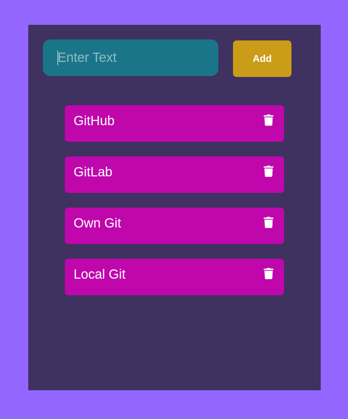

# Reactjs TodoList (CRUD App)

Build A Todo List App with React with Class (Including Hooks)

[](https://basemax.github.io/reactjs-todolist)

## Try & Demo

View preview at: https://basemax.github.io/reactjs-todolist

or build:

```bash
$ git clone https://github.com/BaseMax/reactjs-todolist
$ cd reactjs-todolist
$ npm install
$ npm start
```

## Similar Repository

https://github.com/BaseMax/reactjs-todo-list

### Acknowledgment

I saw an [Youtube video](https://www.youtube.com/watch?v=N8kYlimhuLw) and It's encouraged me to write a similar project myself.

© Copyright Max Base
